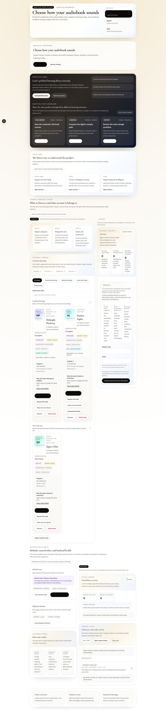
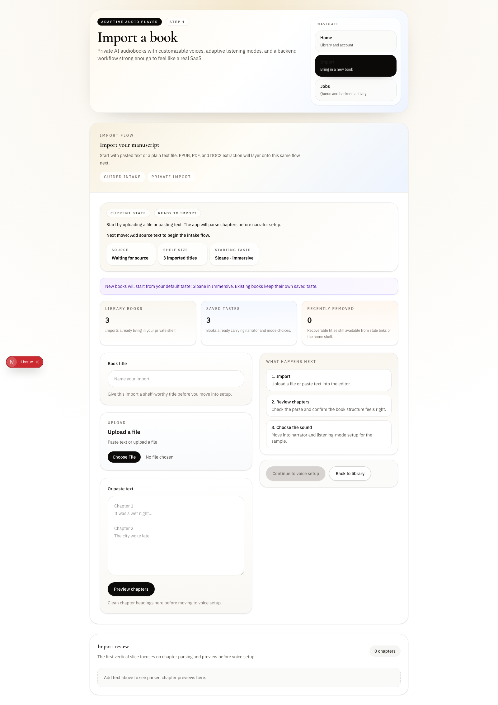
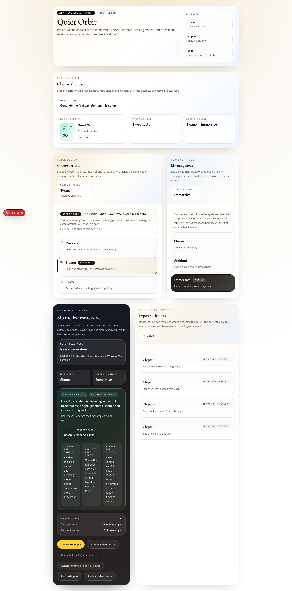
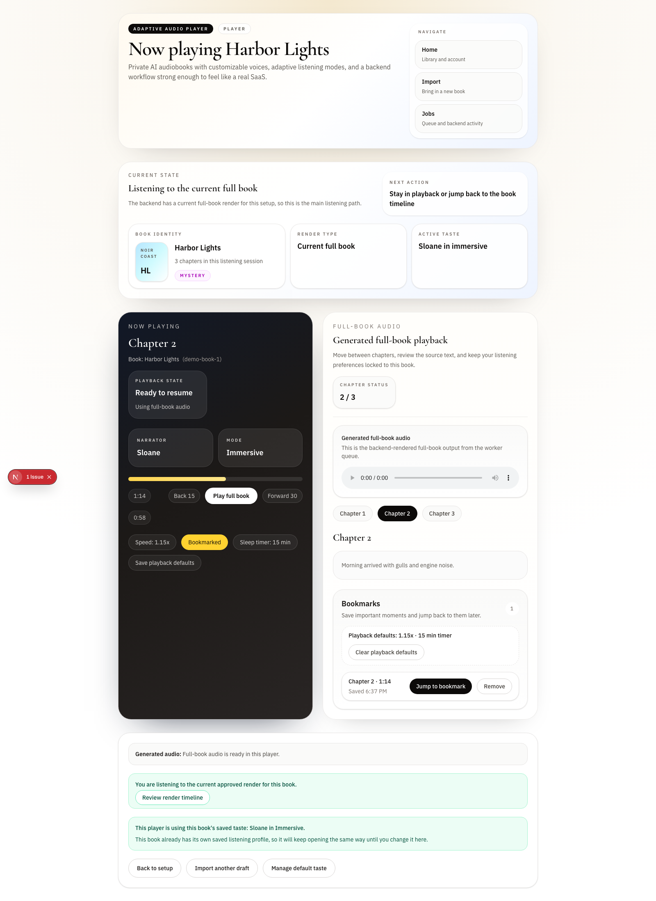
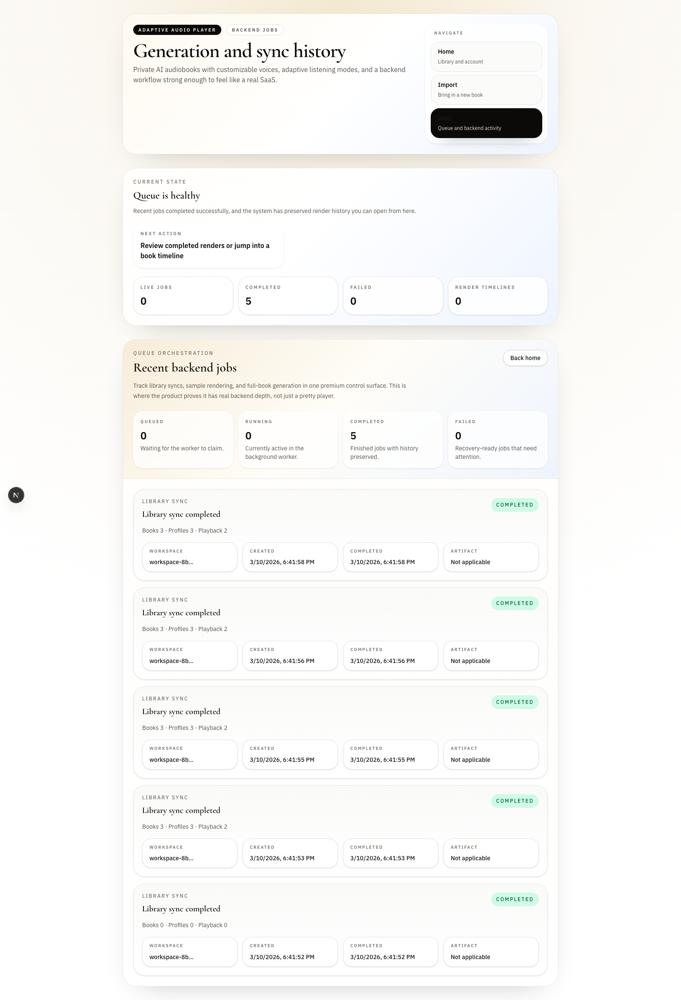

# Adaptive Audio Player
[](https://github.com/bniceley50/adaptive-audio-player/actions/workflows/ci.yml)

Private AI audiobook player for your books and documents, with customizable voices, character-aware narration, and premium listening controls.

## What This Is

This repo is a portfolio-grade prototype for an adaptive audiobook SaaS. The core idea is simple:

- import a book or document
- choose how it should sound
- generate a sample first
- listen in a polished player
- keep render history, sync, jobs, and account/security visible as first-class product features

It is not just a TTS demo. It is designed to show product thinking, backend architecture, account/session hardening, and premium UX in one project.

## Screenshots

### Home dashboard



### Import flow



### Taste setup



### Listening player



### Render and job console



## Why It Stands Out

Most similar repos are strong in one lane:

- document reader
- TTS generator
- audiobook library server
- character-voice experiment

This project intentionally combines:

- adaptive narration product design
- a polished multi-screen listening flow
- worker-backed generation jobs
- server-backed sync and restore
- account/session/security controls
- render history as a first-class concept

## Core Product Flow

1. Import a file or paste text
2. Preview parsed chapters
3. Choose narrator and listening mode
4. Generate a sample
5. Approve the sound
6. Generate full-book audio
7. Listen, resume, bookmark, and restore across sessions

## Main Screens

- `/`
  Home dashboard with library, account/security, cloud sync, and recent render activity
- `/import`
  Guided intake for text and file-based imports
- `/books/[bookId]`
  Taste setup, sample generation, full-book generation, and render history
- `/player/[bookId]`
  Listening surface with render-aware state, playback controls, and chapter context
- `/jobs`
  Render orchestration console with current queue health and per-book render history

## What Is Real In This Repo

- polished home, import, setup, player, and jobs surfaces
- local shelf with demo-mode seeded books
- signed workspace cookies
- signed account sessions with expiry and revocation
- selective and bulk session revocation
- worker-backed generation queue
- backend sync snapshot and restore flow
- generated sample/full-book artifact history
- route-level ownership tests for protected APIs

## Prototype Boundaries

This repo is intentionally scoped as a portfolio prototype. The following
areas are designed but not yet productionized:

| Area | Current state | Production path |
|---|---|---|
| Database | SQLite (local) | Postgres via Supabase |
| Job queue | Local worker process | Cloud queue (SQS/BullMQ) |
| Audio storage | Local filesystem | Object storage + CDN |
| Auth | Custom signed sessions | Hosted auth (Supabase Auth / Clerk) |
| Multi-device | Single-device only | Cloud sync infrastructure exists, needs hosted backend |

For a production-deployed example with Supabase, RLS, hosted auth, and
Vercel deployment, see [Clinic Notes AI](https://github.com/bniceley50/clinic-notes-ai).

## Demo Mode

For portfolio walkthroughs, the app includes a seeded local demo.

After starting the app:

- open `/`
- click `Load portfolio demo`

That seeds:

- a full-book-ready title with listening progress
- a sample-ready title
- a setup-pending title
- default taste and playback defaults
- render history and backend activity

## Try It In 60 Seconds

If you want the fastest possible product tour:

1. Run `pnpm dev:all`
2. Open [http://127.0.0.1:3100](http://127.0.0.1:3100)
3. Click `Load portfolio demo`
4. Walk this path:
   - `Home` → review the library, account/security, and cloud activity
   - `Import` → see the guided intake flow
   - `Storm Harbor` → open setup and inspect taste, sample, and render history
   - `Listen current full book` → open the player
   - `Jobs` → inspect render orchestration and per-book history

Best pages for a quick portfolio review:

- `/`
- `/import`
- `/books/demo-book-1`
- `/player/demo-book-1?artifact=full&renderState=current`
- `/jobs`

## Local Run

```bash
pnpm install
cp .env.example .env.local
pnpm dev:all
```

Open:

- [http://127.0.0.1:3100](http://127.0.0.1:3100)

## Live Demo

Hosted demo: [adaptive-audio-player.vercel.app](https://adaptive-audio-player.vercel.app)

- Open the home screen and click `Load portfolio demo`
- The hosted build uses the same seeded portfolio flow as local development
- If you want the local worker-backed path, run `pnpm dev:all`

## Key Scripts

```bash
pnpm dev:all     # Next dev server + background worker
pnpm worker      # background generation worker only
pnpm build       # production build
pnpm test:e2e    # Playwright browser flow
pnpm gate        # lint + typecheck + unit/route tests
```

## Gate Command

Every change must pass before merge:

```bash
pnpm lint && pnpm typecheck && pnpm test
```

## Stack

- Next.js 16 (RC) — chosen for React 19 server component improvements
  and Turbopack stability; the app does not depend on any unstable APIs
  and can run on Next.js 15 with minimal changes
- TypeScript
- pnpm
- Vitest
- Playwright
- SQLite-backed backend sync and job persistence
- background worker via `node scripts/job-worker.mjs`
- generated audio artifact streaming

## TTS Generation

- If `OPENAI_API_KEY` is set, the worker uses the OpenAI speech API for generated sample/full-book audio.
- If the key is missing, the worker falls back to deterministic local mock audio so the app and tests still run.
- Generated audio is stored under `data/generated-audio/` and streamed through secured app routes.
- Session signing now reads from `ADAPTIVE_AUDIO_PLAYER_SESSION_SECRET`; in production this must be set explicitly.

## Architecture Highlights

- server-backed workspace sync snapshot model
- account session table with revocation and expiry
- protected API routes with direct ownership tests
- worker-driven sample/full-book generation
- preserved current vs archived render history
- cloud/library preview and resume logic on the home dashboard

## Good Portfolio Angles

If you are reviewing this repo as an employer or client, the strongest things to inspect are:

- the home/dashboard composition in [src/app/page.tsx](src/app/page.tsx)
- the setup flow in [src/app/books/[bookId]/page.tsx](src/app/books/%5BbookId%5D/page.tsx)
- the player experience in [src/app/player/[bookId]/page.tsx](src/app/player/%5BbookId%5D/page.tsx)
- the jobs console in [src/app/jobs/page.tsx](src/app/jobs/page.tsx)
- the backend/session model in [src/lib/backend/sqlite.ts](src/lib/backend/sqlite.ts) and [src/lib/backend/workspace-session.ts](src/lib/backend/workspace-session.ts)

## Current Limitations

- experimental `node:sqlite` warnings still appear during test/build
- production auth, storage, and queue infrastructure are not yet swapped in
- real cloud deployment is the next major step after portfolio/demo readiness

## Next Production Steps

- hosted auth
- Postgres
- object storage for imports and generated audio
- persistent cloud queue
- production session and sync infrastructure
- mobile-grade playback and offline downloads

## See Also

**[Clinic Notes AI](https://github.com/bniceley50/clinic-notes-ai)** —
A production-deployed clinical documentation app (Next.js, Supabase, Vercel)
with magic-link auth, row-level security, HIPAA-adjacent data handling,
Sentry monitoring, and CI/CD. If this repo shows product and UX thinking,
Clinic Notes AI shows backend architecture, security hardening, and
operational maturity. Together they represent the full stack.
