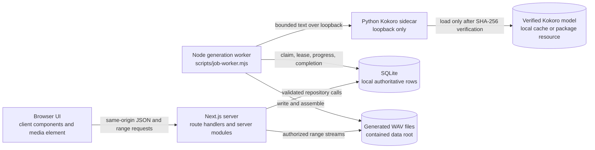
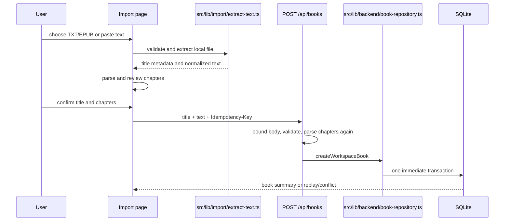
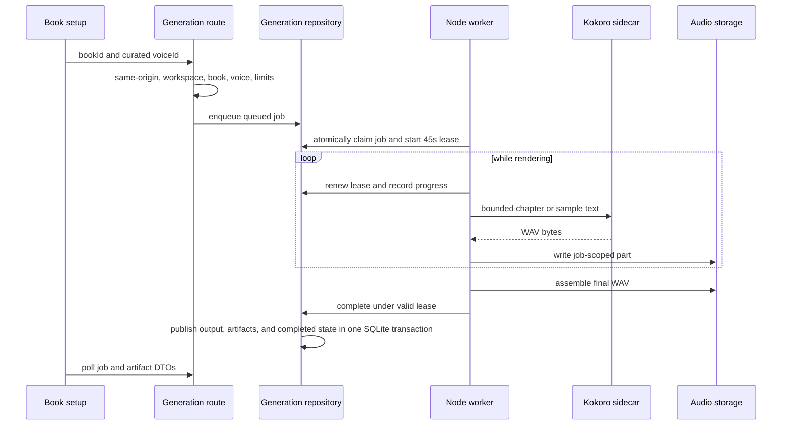
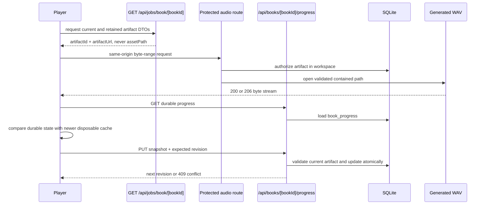
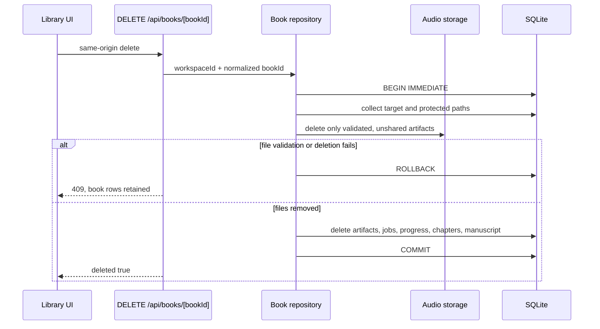
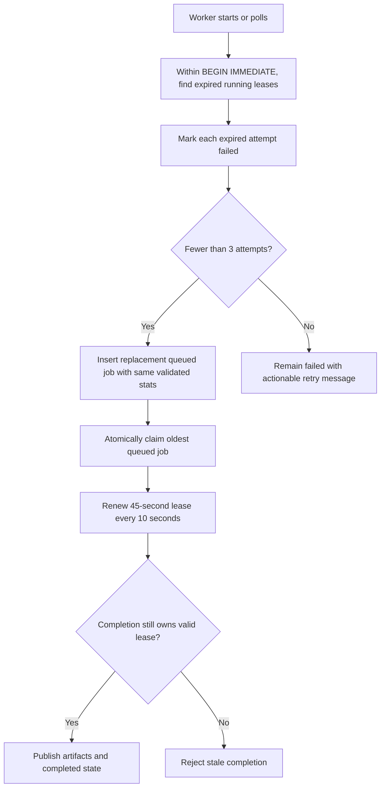

# Architecture

## Status and invariant

The implemented source build is a private, single-user, local application. SQLite and contained files are authoritative; browser storage is disposable UI cache. The signed Windows desktop package described in `docs/packaging-plan.md` is still a release target, not a current runtime.

The local operating-system user and the application form the v1 trust boundary. A signed, HTTP-only workspace cookie partitions local records, but it is not an account or a claim of isolation between people sharing the same OS profile.

## Process and trust boundaries

`scripts/dev-with-worker.mjs` supervises the sidecar, worker, and Next.js process in development. It validates a ready Python 3.12 environment, waits for loopback health, stops the process tree when a required child exits, and does not install packages during discovery.

Boundary rules:

- The browser never opens SQLite, resolves a local path, contacts the sidecar, or reads a signing secret.
- Route handlers derive the workspace namespace from `src/lib/backend/workspace-session.ts`; request bodies do not choose it.
- State-changing routes use `src/lib/backend/csrf.ts` to enforce same-origin requests.
- The worker and Next server share SQLite and the generated-audio root. SQLite WAL mode, a busy timeout, short write transactions, and job leases coordinate them.
- The sidecar accepts loopback traffic only. It receives narration text from the local worker and returns bounded WAV data.
- Raw manuscripts, generated files, SQLite rows, local paths, the session secret, and model paths are private even though the product is single-user.

## Sources of truth

| Domain | Authoritative source | Owner | Browser exposure |
|---|---|---|---|
| Book metadata, manuscript, chapters | `synced_books` and `book_chapters` | `src/lib/backend/book-repository.ts` | Summaries are broadly used; manuscript and chapter text are returned only by the private book-detail route. |
| Import replay protection | `book_create_requests` | `src/lib/backend/book-repository.ts` | Only `replayed` and conflict outcomes are exposed. Fingerprints stay server-side. |
| Generation jobs and leases | `sync_jobs` | `src/lib/backend/generation-repository.ts` | Status DTOs only; lease timestamps and raw JSON are server concerns. |
| Current playable output | `generated_outputs` | `src/lib/backend/generation-repository.ts` | Public artifact IDs and application URLs replace filesystem paths. |
| Retained artifacts for the current generation set | `generated_output_history` | `src/lib/backend/generation-repository.ts` | Public artifact DTOs omit `assetPath` and `workspaceId`. |
| Playback progress | `book_progress` | `src/lib/backend/book-repository.ts` | Validated progress DTO with optimistic `revision`. |
| Generated audio bytes | Files below the configured data root | `src/lib/backend/audio-storage.ts` | Streamed by protected application routes with range support. |
| Worker liveness | `worker_heartbeats` | `src/lib/backend/sqlite.ts` and `scripts/job-worker.mjs` | Diagnostic status only. |
| Voice IDs | `src/lib/voices/catalog.ts` | Server-owned catalog and generation validation | Stable product IDs, display names, descriptions, and preview URLs. |
| UI preferences and bookmarks | Browser storage | `src/lib/playback/local-playback.ts` | Disposable local cache; never the durable manuscript or artifact authority. |

`synced_books` and `sync_jobs` are legacy schema names. They do not imply a cloud service or whole-library synchronization.

## Import flow

TXT and EPUB parsing occurs in the browser because the selected `File` is browser-owned. The backend receives normalized text, validates it again, parses chapters again, and persists the manuscript and chapters atomically. The original TXT or EPUB file is not copied into backend storage.

## Generation flow

Sample generation accepts the requested curated voice. Full-book generation derives its voice from the current accepted sample, falling back only through the documented compatibility path. Production generation has no cloud TTS or mock-audio fallback.

Handled render failures remove files tracked during that attempt and mark the job failed. An abrupt process death may leave a job-scoped partial file that was never recorded; the filename remains attributable, but there is not yet a global startup orphan sweep.

## Playback and progress flow

`src/components/player/use-media-controller.ts` owns the media element lifecycle. `src/components/player/now-playing.tsx` hydrates progress, retains bookmarks and UI preferences locally, and uses `src/lib/playback/local-playback.ts` to throttle durable progress writes.

## Deletion flow and transaction boundary

SQLite makes the row deletion atomic, but the filesystem is not part of that transaction. If a database error occurs after a file has been removed, rollback preserves rows but cannot restore that file. Callers must therefore surface a missing-artifact recovery state; the architecture must not claim cross-resource atomicity until a staged-delete or recovery journal exists.

## Restart recovery

The supervisor stops all remaining processes when a required child exits. On the next worker poll, `src/lib/backend/generation-repository.ts` fences expired work, creates at most two automatic replacements after the original attempt, and prevents an expired worker from publishing completion.

## Migrations

`src/lib/backend/database.ts` owns schema versioning through SQLite `user_version`.

- Version 1 creates the historical baseline schema.
- Version 2 removes retired account, profile, snapshot, and community tables and rebuilds `workspaces` without `user_id`, while preserving books, chapters, create requests, jobs, outputs, artifact rows, progress, and worker heartbeats.
- Migrations are contiguous and run under `BEGIN IMMEDIATE` before repositories use the database.
- Foreign-key enforcement is temporarily disabled around a migration, `foreign_key_check` must pass before commit, and the previous enforcement setting is restored.
- A failed migration rolls back and prevents the database from opening. A database newer than the runtime is rejected.

## Retention and failure behavior

- A successful generation replaces the prior output and retained artifact set for the same workspace, book, and generation kind. Superseded unshared files are deleted before the new rows commit.
- Completed, failed, and cancelled job rows older than 30 days are pruned for that book when a later generation completes.
- Book deletion removes validated generated files and then deletes that book's artifact, job, progress, chapter, manuscript, and idempotency rows through repository-owned operations.
- Missing files never produce simulated playback. Routes return a missing-artifact response and the UI offers recovery.
- Cancellation changes eligible queued or running jobs to `cancelled`; the worker checks current state before publishing.
- Sidecar unavailability, response limits, invalid WAV data, corrupt model weights, and expired leases fail closed.

## Desktop packaging boundary

The planned desktop host will supervise the same server, worker, and sidecar boundaries, allocate authenticated ephemeral loopback ports, bundle the verified model, and keep application state inside the Windows package data container. Until that proof exists, source-development behavior must not be described as a shipped desktop runtime.
