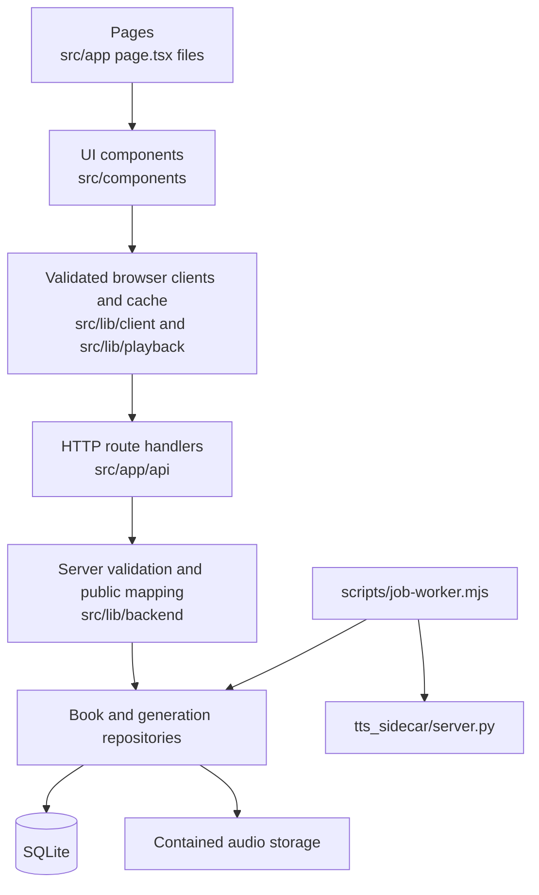

# Module Boundaries

## Purpose

These boundaries describe the implemented local v1. They identify which module may decide product behavior, persistence, exposure, and lifecycle. A route or component may orchestrate an owner; it must not silently become a second owner.

## Layer map

Dependencies point downward. The worker may call repository and storage owners directly because it is a trusted server process. Browser code reaches them only through a route DTO.

## 1. Product pages

Existing pages:

- `src/app/page.tsx` — Library.
- `src/app/import/page.tsx` — two-step source and review flow.
- `src/app/books/[bookId]/page.tsx` — voice preview, sample acceptance, and full-book generation.
- `src/app/player/[bookId]/page.tsx` — playback-source orchestration and recovery states.

Pages may:

- resolve route and query parameters;
- compose existing components;
- request explicit browser clients;
- select a view state from already-owned domain results.

Pages must not:

- access SQLite, the filesystem, environment secrets, or the sidecar;
- invent readiness from browser cache;
- construct a generated-audio path;
- accept a voice, artifact, or workspace identity without server validation;
- create a second import, job, progress, or playback contract.

## 2. UI components and feature support

Existing component owners include:

- `src/components/import/import-source.tsx` — source-choice controls and truthful limits.
- `src/components/voices/voice-choice.tsx` — curated voice selection and preview interaction.
- `src/components/player/now-playing.tsx` — player state hydration and durable-progress scheduling.
- `src/components/player/use-media-controller.ts` — the one media-element controller.
- `src/features/reader/shared-support.ts` — shared reader presentation helpers.

Components and feature helpers may own interaction state, formatting, accessibility behavior, and pure view-model transformations. They must not directly query repositories or decide whether an artifact is current.

No new feature directory should be documented before it exists. Extract a feature helper when the rule is shared or independently testable; keep one-off composition in the page.

## 3. Browser clients and disposable state

- `src/lib/client/books-api.ts` owns book-list, book-detail, creation, deletion, response parsing, and summary metadata cache.
- `src/lib/playback/local-playback.ts` owns progress HTTP calls, throttled optimistic writes, bookmarks, playback defaults, and disposable playback cache.
- `src/lib/playback/resolve-playback-source.ts` selects an exact current or retained artifact from already-public generation DTOs.
- `src/lib/import/extract-text.ts` performs bounded TXT and EPUB extraction in the browser.
- `src/lib/parser/parse-chapters.ts` provides deterministic chapter parsing used for review and repeated by the server.
- `src/lib/validation/import-validation.ts` owns shared public import limits and messages.

Browser clients must parse unknown JSON into a declared DTO before returning it. Browser storage may improve transitions but cannot become authoritative for a manuscript, artifact, job, or durable progress.

## 4. HTTP route handlers

Route handlers in `src/app/api` own the network boundary. Their responsibilities are:

- normalize route IDs and bounded request bodies;
- derive workspace identity from the signed cookie;
- enforce same-origin checks on mutations;
- call one domain or repository operation;
- map private records to explicit response DTOs;
- translate domain outcomes into stable HTTP status and error shapes;
- apply `no-store` to private responses.

Routes must not return a SQLite row or filesystem path merely because a server type is serializable. Generation routes should use one shared public-job mapper; the broader job summaries currently returned by status, history, cancel, and retry routes are compatibility debt, not a pattern to copy.

## 5. Server policy and boundary helpers

- `src/lib/backend/workspace-session.ts` owns opaque local workspace IDs and signed-cookie verification.
- `src/lib/backend/csrf.ts` owns same-origin mutation checks.
- `src/lib/backend/env.ts` owns path, secret, loopback URL, timeout, and data-root configuration.
- `src/lib/backend/validate-generation-request.ts` owns generation kinds, curated voice acceptance, compatibility mode, book limits, and duplicate-active-job validation.
- `src/lib/backend/public-generation.ts` owns server-to-browser artifact mapping.
- `src/lib/voices/catalog.ts` owns stable product voice IDs, display names, and Kokoro mappings.

These helpers may know policy but must not open SQLite or render UI. Public mappers must be allowlists: adding a private server field must not expose it automatically.

## 6. Repository ownership

| Owner | May read/write | Must not own |
|---|---|---|
| `src/lib/backend/database.ts` | Connection lifecycle, pragmas, schema migrations, `user_version`. | Product DTOs, route errors, or generated-file paths. |
| `src/lib/backend/book-repository.ts` | Workspaces, books, manuscripts, chapters, create idempotency, progress, coordinated book deletion. | UI cache, HTTP parsing, TTS, or player behavior. |
| `src/lib/backend/generation-repository.ts` | Job enqueue/claim/lease/recovery/status, current outputs, retained artifacts, generation retention. | TTS transport, WAV encoding, browser URLs, or UI copy. |
| `src/lib/backend/audio-storage.ts` | Contained generated paths, atomic writes, part deletion, WAV assembly, file reads. | Workspace authorization or HTTP DTOs. |
| `src/lib/backend/http-audio.ts` | File stat, one-range parsing, bounded stream responses. | Choosing an artifact or resolving an untrusted path. |
| `src/lib/backend/tts.ts` | Bounded loopback request/response transport and actionable TTS failures. | Job state transitions, model download policy, or UI fallback audio. |
| `src/lib/backend/sqlite.ts` | Compatibility re-exports and worker-heartbeat access still used by routes/scripts. | New domain logic; new work belongs in the focused repository. |

Repository functions accept a trusted `workspaceId` from the route or worker boundary. They still include it in every ownership query; no repository operation may locate a private book, job, or artifact by public ID alone.

## 7. Transaction ownership

| Operation | Transaction owner | Atomic guarantee | Outside the transaction |
|---|---|---|---|
| Database migration | `src/lib/backend/database.ts` | One version, foreign-key check, and `user_version` commit together. | No separate backup archive. |
| Book creation | `createWorkspaceBook` in `src/lib/backend/book-repository.ts` | Workspace, book, chapters, and idempotency record commit together. | Browser file extraction and request transmission. |
| Progress update | `saveWorkspaceBookProgress` in `src/lib/backend/book-repository.ts` | Current-artifact check, expected revision, and next row commit together. | Browser cache and media position between writes. |
| Job claim/recovery | `claimNextGenerationJob` in `src/lib/backend/generation-repository.ts` | Expired-job fencing, replacement enqueue, and one queued-job claim share one immediate transaction. | Worker process health and unrecorded partial files. |
| Job completion | `completeGenerationJob` in `src/lib/backend/generation-repository.ts` | Valid-lease check, output rows, artifact rows, and completed job state commit together. | Superseded file deletion cannot be rolled back. |
| Book deletion | `deleteWorkspaceBook` in `src/lib/backend/book-repository.ts` | Related SQLite row deletion commits or rolls back together. | Validated generated files are removed before row commit and cannot be restored by rollback. |

Do not add an inner transaction beneath these owners. Compose validation before entering the transaction and keep external network work outside it.

## 8. Worker and sidecar

- `scripts/job-worker.mjs` owns polling, heartbeat publication, lease renewal, and process-level failure reporting.
- `scripts/job-worker-lib.mjs` owns sample/full-book rendering orchestration, chapter iteration, tracked-part cleanup, and WAV assembly calls.
- `tts_sidecar/server.py` owns the loopback HTTP contract and lazy Kokoro pipeline.
- `tts_sidecar/core.py` owns sidecar settings, voice resolution, model location, SHA-256 verification, and offline behavior.

The worker must claim before rendering, renew while active, and complete only through the repository. The sidecar must never write SQLite, select a workspace, or receive a filesystem destination from the browser.

## 9. Compatibility code that is not an active boundary

The following existing modules contain retired or transitional behavior and must not become dependencies of new v1 work:

- `src/lib/library/local-library.ts` contains disposable library metadata and sample-request compatibility state.
- `src/lib/library/local-quotes.ts` removes retired quote excerpts from browser storage and must not regain product behavior.
- `src/lib/backend/mock-audio.ts` is test support, not a production generation provider.

Remove these only after a reference audit proves no active route, component, migration, or test contract requires them. Until then, isolate them and do not describe them as supported product architecture.

## Extension checklist

1. Name the owning layer and existing owner before editing.
2. Define private server data separately from the public DTO.
3. Keep workspace derivation, same-origin validation, and request bounds at the route boundary.
4. Put multi-row invariants in the owning repository transaction.
5. Keep network and filesystem effects outside SQLite when possible; document compensation where that is impossible.
6. Add focused tests for success, conflict, ownership, bounds, and forbidden-field exposure.
7. Run `pnpm gate`, `pnpm build`, the focused Playwright listening flow when UI behavior changes, and Python sidecar tests when the sidecar contract changes.
