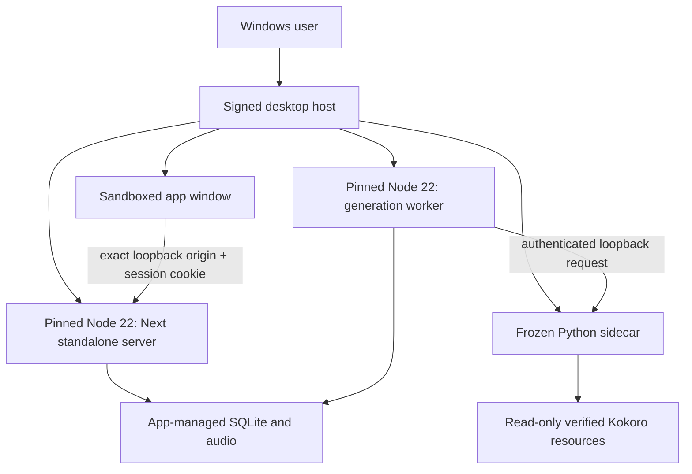

# Windows 11 x64 packaging plan

Status: approved architecture plan; the audited implementation manifest below
awaits explicit package and toolchain approval.

This plan turns the private local application into a per-user Windows 11 x64
desktop product that installs, launches, generates, plays, restarts, updates,
and uninstalls without a terminal or a separately installed Node or Python.
It is intentionally a gate before any desktop framework, freezer, installer,
or release service is added.

## Release outcome

The supported release is one signed MSIX package for Windows 11 x64. It owns a
single visible desktop window and supervises all required local processes. A
clean machine must not need Git, Node, pnpm, Python, Rust, a compiler, or a
terminal.

The production package contains:

- a desktop host and sandboxed renderer;
- the pinned Node 22 x64 runtime;
- the traced Next.js standalone server, static assets, and generation worker;
- a frozen one-folder Python 3.12 x64 Kokoro sidecar;
- the exact verified Kokoro model and curated voice resources; and
- license notices, version metadata, and a software bill of materials.

MP3/M4B re-narration is implemented in the source build but is not yet an
approved package capability. A package that advertises it must also contain an
exact FFmpeg/FFprobe build with the Whisper filter and the verified Whisper
model, with the complete binary closure, redistribution obligations, source
offer where required, notices, SBOM entries, offline verification, and cleanup
tests. Until that separate gate passes, the release must fail closed and must
not claim packaged audio transcription support.

The package does not contain development dependencies, a repository checkout,
the development virtual environment, pnpm, a writable model cache, sample user
data, or generated audio.

## Approval boundary

This document does not authorize a dependency or toolchain change. The first
proof requires explicit approval of this exact candidate manifest:

| Input | Exact candidate | Integrity and license |
| --- | --- | --- |
| Desktop runtime | `electron@43.1.1` | npm integrity `sha512-I5c5vfuVvaXpWx3IZdwvXgxQW44+e7OP1wXGVQkogLeSFSkUZ6sLCcWV05AdEcs65AO5tAIJJwbp7ixw+LdarA==`; MIT |
| Desktop packager | `@electron/packager@20.0.0` | npm integrity `sha512-kl4c4LcsrQflg0wAi3mqpmmZFRdTYoZFLZPBP9YeEIvWwQR1NmkZphwT7558UeLOdhr6Ac5l83r8W69KaJBedg==`; BSD-2-Clause |
| Electron fuse editor | `@electron/fuses@2.1.3` | npm integrity `sha512-LoKJUXNiJ4JM8IIrUltSHI+8pkogaGj5wmJx81jE/Wk3g2w1/kfMbTEKNoY5kitGE8hiC12h32R/1SlywFtxXg==`; MIT |
| Electron Windows binary | `electron-v43.1.1-win32-x64.zip` | SHA-256 `b4e9995cd3f65785eb8818276aa9020f3165ab11da41b3c762616d4a0ad8c7ad`; upstream release asset |
| Python freezer | `PyInstaller==6.21.0` using `pyinstaller-6.21.0-py3-none-win_amd64.whl` | SHA-256 `7fae06c494ce0ebfe6bd3055c0e409def884f63af2e3705d06bd431ad9237fc7`; GPL-2.0 with the bootloader exception plus identified Apache-2.0 components |
| Child-process runtime | official `node-v22.23.1-win-x64.zip` | SHA-256 `7df0bc9375723f4a86b3aa1b7cc73342423d9677a8df4538aca31a049e309c29`; Node.js license and bundled notices |
| MSIX tooling | installed Windows SDK x64 `MakeAppx.exe`, `MakePri.exe`, and `SignTool.exe`, product version `10.0.26100.7705` | Microsoft Windows SDK redistribution and signing terms apply |

The proven development-only transcription inputs are recorded for audit, not
approved for redistribution:

| Input | Verified development identity | Release status |
| --- | --- | --- |
| FFmpeg | `8.1.1-full_build-www.gyan.dev`, `ffmpeg.exe` 227,398,656 bytes, SHA-256 `09948d4cdd0650da6ff5a87577469f2a218dc2615ae379f8f734d24c49de0f73` | Built with `--enable-gpl --enable-version3 --enable-whisper`; not approved for the package. |
| FFprobe | Matching 8.1.1 full build, 227,193,344 bytes, SHA-256 `a6618e99bb58869ded3c6f37b53aa1a8d701c3591dbb7b5b317d47369c112be2` | Same unapproved GPL-enabled binary closure. |
| Whisper model | `ggerganov/whisper.cpp` revision `5359861c739e955e79d9a303bcbc70fb988958b1`, `ggml-base.en.bin` 147,964,211 bytes, SHA-256 `a03779c86df3323075f5e796cb2ce5029f00ec8869eee3fdfb897afe36c6d002` | Verified for source testing; package placement, licensing notices, and release approval remain pending. |

Electron 43 is supported through 2027-01-05. A disposable pnpm 11.3.0
resolution of the three desktop packages, with lifecycle scripts disabled,
produced 68 packages: 3 direct and 65 transitive. `pnpm audit` reported zero
known advisories at every severity. The installed license inventory was 49 MIT,
7 ISC, 5 BSD-2-Clause, 5 BlueOak-1.0.0, and 2 Apache-2.0, with no unknowns.
Approval adds the three exact npm packages as development dependencies, records
their closure in `pnpm-lock.yaml`, and allowlists only Electron's required
installer in `pnpm-workspace.yaml`; Packager and Fuses do not receive lifecycle
script permission. The real frozen install, binary digest, licenses, and audit
must be reverified after that change.

The frozen model input is `hexgrad/Kokoro-82M` revision
`f3ff3571791e39611d31c381e3a41a3af07b4987`, licensed Apache-2.0. Only these
files are approved for the v1 package:

| Model resource | SHA-256 |
| --- | --- |
| `kokoro-v1_0.pth` | `496dba118d1a58f5f3db2efc88dbdc216e0483fc89fe6e47ee1f2c53f18ad1e4` |
| `config.json` | `5abb01e2403b072bf03d04fde160443e209d7a0dad49a423be15196b9b43c17f` |
| `voices/af_heart.pt` | `0ab5709b8ffab19bfd849cd11d98f75b60af7733253ad0d67b12382a102cb4ff` |
| `voices/af_bella.pt` | `8cb64e02fcc8de0327a8e13817e49c76c945ecf0052ceac97d3081480e8e48d6` |
| `voices/am_michael.pt` | `9a443b79a4b22489a5b0ab7c651a0bcd1a30bef675c28333f06971abbd47bd37` |

These verified, package-owned resources are the only model pickles the release
may load; users cannot substitute an untrusted model or voice file. The Python
build closure must be captured in a separate exact, hash-pinned build
requirements file and audited with the already pinned sidecar runtime before
the freezer task runs.

Implementation starts only after the user explicitly approves the applicable
entries. This approval does not select a production certificate, package
identity, Store account, or update channel; those remain separate release
decisions. No floating version is approved.

## Architecture choice

### Recommended proof: Electron host with native MSIX packaging

Electron is the first proof because the application already depends on a
dynamic Next.js server, Node built-ins including `node:sqlite`, and supervised
Node and Python workers. It exercises that architecture without first rewriting
the product in Rust or replacing the server APIs.

Electron is only the window and lifecycle owner. Production server and worker
processes use the separately bundled, pinned Node 22 runtime. They do not depend
on Electron's embedded Node version or its `runAsNode` behavior. The production
host disables the `runAsNode` and command-line inspection fuses unless a later
security review proves a narrowly scoped need.

Direct Electron Packager is the proof build orchestrator. It creates the
Windows application directory, and official Windows SDK tools create and sign
the outer MSIX. Electron Forge 7.11.2 is not used: its dependency closure routes
through `@electron/rebuild@3.7.2` to a Git-hosted `@electron/node-gyp`
subdependency that pnpm 11.3.0 rejects, and the same rebuild line has an open
known-vulnerable `tar@6.2.1` dependency. Forge 8 is prerelease software and is
not a production-proof basis. This application does not load project native
modules in Electron, because the server and worker run under the separately
bundled Node 22 runtime, so Forge's native-module rebuild layer is unnecessary.

### Alternatives held in reserve

| Option | Benefit | Why it is not the first proof |
| --- | --- | --- |
| Tauri 2 with WebView2 | Smaller desktop host and system-managed browser runtime | Adds Rust and a second build ecosystem while still requiring the Node 22 server and Python/model payload. |
| Native Windows host | Tight Windows integration | Requires the largest rewrite and provides no early evidence that the current listening loop packages correctly. |
| Browser/PWA only | Smallest wrapper | Cannot deliver the bundled and supervised local model, worker, database, and update contract. |
| Replace Python with ONNX or another runtime | May reduce installed size and startup cost | Changes synthesis behavior and quality. Consider only after the faithful Python proof supplies measured evidence. |

If the Electron proof fails a clean-machine security, reliability, startup, or
size gate, stop and compare Tauri and a replacement inference runtime using the
same measurement record. Do not carry a failed proof into production.

## Runtime topology



One desktop-host instance owns the entire process tree. A named per-user mutex
prevents two supervisors from opening the same database. A second launch focuses
the existing window and exits.

### Startup

1. Resolve package resources and the Windows app-data location without using the
   current working directory, `PATH`, or a shell.
2. Create bounded log and temporary directories and acquire the single-instance
   lock.
3. Generate independent cryptographically random launch secrets for the app
   server and TTS sidecar.
4. Ask Windows for unused loopback ports; do not use a release-wide fixed port.
5. Start the sidecar with absolute paths, the read-only model path, its loopback
   port, and its launch secret. Wait for the versioned health response.
6. Start the worker with absolute paths, the database/data roots, sidecar origin,
   and sidecar secret. Wait for worker readiness.
7. Start the Next standalone server on `127.0.0.1` and its selected port. Wait
   for the exact app health response.
8. Install an HTTP-only, same-site session cookie in the dedicated renderer
   session, then load only the exact loopback origin.
9. Show one actionable recovery window if startup cannot finish; never expose a
   console window or raw command line.

Startup has a bounded deadline and reports which component failed. It never
downloads packages, creates a Python environment, or silently changes the model.

### Shutdown and recovery

- Normal window exit first stops accepting new work, asks the worker to persist
  state, stops server and sidecar children, and then force-terminates only the
  owned process tree after a bounded grace period.
- Host crash or forced termination must not leave children. Use a Windows Job
  Object, or an equivalently proven kill-on-owner-close mechanism, rather than
  relying only on signal emulation.
- An unexpected required-child exit makes the host mark the component unhealthy,
  preserve durable job state, perform at most two bounded restart attempts with
  backoff, and then show an actionable error. It must not spin indefinitely.
- Existing generation recovery remains authoritative: within the approved
  60-second target, every interrupted running job requeues or fails actionably
  without false completion or data loss.
- Updates and uninstall never begin a new render. An active render must finish,
  cancel cleanly, or persist recoverable state before the host exits.

## Bundled Node and Next application

Set Next.js `output: "standalone"` for the packaging build. Copy the traced
server, required `.next/static` content, public assets, worker script, and only
the explicitly traced runtime files into a staging directory. Verify the staged
server from outside the repository before packaging.

Use an official pinned Node 22 x64 runtime verified against its published
checksum. Invoke `node.exe` directly with an argument array and `shell: false`.
The process working directory is an explicit package resource directory; every
writable path arrives separately from the host.

The package must prove that:

- `node:sqlite`, Next route handlers, range streaming, EPUB parsing, and the
  generation worker behave in the standalone trace;
- `public` and Next static assets are present;
- neither the repository `node_modules` tree nor pnpm is in the payload;
- no development server, source map containing private paths, or test fixture is
  shipped; and
- production children run without visible console windows.

## Python and model distribution

The current virtual environment is not a release artifact. Python documents
virtual environments as disposable and non-portable, and their scripts contain
absolute interpreter paths. Copying `.venv` would create a machine-specific and
unverifiable installation.

The first proof freezes the pinned Python 3.12 sidecar and its native
dependencies as a PyInstaller **one-folder** application. One-folder is easier
to inspect and debug, avoids extracting roughly a gigabyte of native libraries
to a temporary directory on every launch, and is the official prerequisite
before considering one-file mode.

The proof must explicitly collect and test Kokoro, PyTorch CPU libraries,
NumPy, SoundFile/libsndfile, FastAPI/Uvicorn, English tokenization data, and all
required native DLLs. It must launch with no system Python and with `PATH`
restricted to normal Windows locations.

The release bundles the exact model, config, and three approved voice resources
listed in the approval manifest. It verifies every SHA-256 before the first
render. The sidecar receives explicit read-only resource paths; it does not
depend on a writable Hugging Face cache layout or a floating repository branch.

Bundling the model is the default because v1 is private and local-first. The
release acceptance result for first-launch model network transfer is therefore
zero bytes, and generation must work with networking disabled. A smaller
installer that downloads weights later is a separate product decision requiring
clear consent, progress/cancel/retry UX, HTTPS origin pinning, checksum and size
validation, a partial-download quarantine, disk preflight, and an offline error.

The Kokoro model card identifies the weights as Apache-2.0. Redistribution is
still conditional on a complete license inventory for the selected model files,
voice packs, tokenizer/phonemizer data, and native dependencies.

## Local service security and firewall behavior

All listeners bind only to `127.0.0.1`; do not bind to `0.0.0.0`, a LAN address,
or a hostname that can resolve remotely. The app asks the OS for ephemeral ports
for each launch. No installer or application step creates a Windows Firewall
rule. Any first-launch firewall prompt is a release blocker.

Loopback alone is not authentication. The host creates at least 256 bits of
random secret material per launch:

- the Next server rejects requests without the host-installed HTTP-only session
  cookie and validates `Host`, `Origin`, and request size at its boundary;
- the TTS sidecar rejects requests without its independent worker/server secret;
- secrets are passed directly to children, never written to logs, crash dumps,
  command-line arguments, the registry, URLs, or persistent storage; and
- health endpoints expose only component name, compatible version, and readiness.

The Electron renderer uses `nodeIntegration: false`, context isolation,
sandboxing, a restrictive Content Security Policy, denied permission requests,
and no raw Electron API bridge. Navigation and new windows are denied unless an
exact allowlist action opens a fixed HTTPS support/license URL in the system
browser. DevTools and remote debugging are disabled in production. The renderer
profile is dedicated to this app and does not persist the launch cookie.

## Storage paths and data lifecycle

The install directory is read-only. The host resolves the Windows package's
application-data folder through a framework or Windows API; it never constructs
a Package Family Name path or uses `process.cwd()` as a data root.

The intended logical layout is:

```text
ApplicationData.LocalFolder/
  database/adaptive-audio-player.sqlite
  generated-audio/
    .parts/
  tts-renders/
  browser-profile/
  logs/
  temp/
```

The model and program resources remain in the signed, read-only package. The
host supplies absolute data, database, render, and resource paths to Node and
Python. All three processes must resolve the same app-data root, and existing
generated-file containment checks remain mandatory.

App-managed manuscripts, database state, generated audio, temporary parts,
browser state, model cache if one is ever introduced, and logs live in the MSIX
container. Windows removes that managed state on uninstall. Original files that
the user imported and audio explicitly exported to a user-selected location are
outside the container and remain untouched. The product must explain this
boundary and offer export before release; it must not imply that uninstall can
be undone.

MSIX upgrades preserve app data. Production update work therefore waits for the
versioned, transactional database migrations in Task 8.1. A migration failure
must leave the prior database usable and prevent the new runtime from starting.

### Disk requirements

Current development measurements are evidence of the problem, not release-size
estimates:

| Item | Current measured size |
| --- | ---: |
| Repository `node_modules` | 440.9 MiB |
| Python virtual environment | 1,035.9 MiB |
| Hugging Face model cache | 313.6 MiB |
| Official Node executable | about 88 MiB |
| Sample generated-audio data | 2.2 MiB, excluded from package |

The proof records compressed MSIX size, installed package size, app-data size,
and temporary peak separately. No installed-size target is approved until that
evidence exists.

Before generation, calculate required working space from the estimated PCM
output plus chapter parts, final assembly, database growth, and a fixed safety
reserve. Refuse before rendering if free space is insufficient. The calculation
must cover the period when chapter parts and the final WAV coexist and must
never assume the filesystem can accept the WAV format's theoretical maximum.
On an out-of-space error, remove only contained partial artifacts and retain an
actionable, retryable job state.

## Signing, build provenance, and updates

MSIX packages must be signed. Development proofs use a clearly labeled
self-signed certificate only on disposable test machines. Production uses one
of these approved channels:

1. Microsoft Store distribution, which is the recommended default because the
   Store signs submissions and supplies the consumer update channel; or
2. a trusted publisher certificate or Azure Artifact Signing plus an HTTPS
   `.appinstaller` feed, if direct distribution is later required.

That channel choice is a release decision; the proof must not silently choose
it. The package identity and production certificate subject must match exactly.

Release builds run on a pinned Windows x64 runner from a protected tag. The job
uses lockfiles with frozen installs, verifies downloaded Node/model inputs by
hash, produces an SBOM and checksums, and retains build logs without secrets or
private paths. Signing credentials are isolated to the protected release job;
pull requests and local development cannot access them.

Sign project-owned executables and the final MSIX with SHA-256 and trusted
timestamping. Preserve and validate upstream signatures on third-party
executables, then rely on the signed MSIX manifest to cover every packaged file.
Verify the final package with Windows SDK signature tooling and install it on a
clean machine before publication.

Updates use Windows/MSIX update behavior, not a second in-app updater. Accept
only a higher version with the same package identity and a trusted signature.
Direct distribution additionally requires HTTPS, a signed update payload, a
pinned feed origin, and App Installer configuration checked into source. Do not
load executable code, scripts, plugins, or model binaries from an unsigned
update location.

Binary rollback is allowed only when its database schema is compatible. Never
force a downgrade across an irreversible migration. Store or direct updates
must be exercised with an active library, a queued job, a failed migration
fixture, offline startup, and a corrupted/tampered package.

## Crash logs and support evidence

There is no telemetry or automatic crash upload in v1. Store local structured
logs under the app-data `logs` folder with five files capped at 1 MiB each. Log
timestamp, app/component version, lifecycle state, stable error code, and
sanitized exception class only.

Never log manuscript text, generated audio, session secrets, HTTP cookies,
database contents, book titles, user names, full local paths, environment dumps,
or child command lines. Scrub paths and identifiers before writing. Windows
Error Reporting dumps can contain private memory; do not collect or upload dumps
by default. A future diagnostic export requires explicit user action, previews
the included files, and applies the same redaction rules.

On clean uninstall, package-managed logs and temporary files are removed with
the app container. On crash and next launch, cleanup is limited to verified
stale files inside the known `.parts` and temp roots; never recursively delete a
computed broad path.

## Licenses and notices

Before a redistributable proof leaves the development machine, generate and
review an inventory for:

- application npm runtime dependencies, Electron/Chromium, Next.js, React, the
  Node distribution, and bundled Node notices;
- Python, PyInstaller's bootloader exception, every pinned sidecar distribution,
  PyTorch/native DLLs, SoundFile/libsndfile, tokenizer/phonemizer resources, and
  any Visual C++ runtime;
- Kokoro code, model weights, voice packs, model card, and required NOTICE or
  attribution files; and
- Windows SDK redistribution terms and every project-owned media/font asset.

Fail the release if a dependency has an unknown license, a redistribution term
is unsatisfied, or generated notices differ from the reviewed lockfiles. Include
human-readable `THIRD_PARTY_NOTICES` and model attribution in the installed
package and an accessible About screen. Retain machine-readable SBOM and source
revision evidence with the release artifacts.

## Proof measurements and acceptance record

Run the proof on a documented, clean Windows 11 x64 virtual machine with no
developer tools, no system Node/Python, a standard non-administrator account,
Windows Defender enabled, and networking disabled for the offline pass.

Record, with cold and warm runs where applicable:

| Measure | Required result |
| --- | --- |
| MSIX download and installed size | Measured; threshold decided after the first proof |
| First window and usable-library time | Measured from launch request; no terminal or firewall prompt |
| First-launch model transfer | 0 network bytes for the bundled-model release |
| 1,000-character sample | p95 under 60 seconds after model installation on the release reference machine |
| Restart recovery | Every interrupted job requeues or fails actionably within 60 seconds |
| Idle and generation CPU/RAM | Measured for host, server, worker, and sidecar separately |
| Temporary and final disk peak | Measured for sample and maximum validation-corpus book |
| Uninstall | Package-managed binaries, state, model, cache, logs, and temp removed; external exports untouched |

The clean-machine scenario must install by normal Windows UI, launch from Start,
import a bounded TXT and EPUB, preview a real voice, generate and play a sample,
generate and range-play a complete book, persist progress, close/reopen, recover
from forced worker and host exits, update across a representative migration,
and uninstall. Repeat offline, with insufficient disk, corrupt model, blocked
loopback port, non-ASCII Windows user path, and standard-user permissions.

A Windows Defender or SmartScreen warning, firewall prompt, visible console,
or orphan process is a release failure, not a documentation issue.

## Atomic implementation tasks after dependency approval

Each task changes at most three files and stops after its focused verification
and the full repository gate. Proof artifacts live outside the production flow
and are not published. Revise these tasks using measured proof evidence before
starting release hardening.

1. **Approve and pin desktop build dependencies.** Change `package.json`,
   `pnpm-lock.yaml`, and one build-policy record. Verify frozen installation,
   licenses, provenance, and the existing gate.
2. **Produce a Next standalone staging tree.** Change `next.config.ts`, one
   staging script, and its focused test. Run the staged server from outside the
   repository using the pinned Node 22 runtime.
3. **Create the sandboxed desktop shell proof.** Add the Electron main entry,
   the minimal direct-Packager configuration, and a focused lifecycle/security
   test. Load only the staged loopback app; do not yet add production update
   behavior.
4. **Freeze the Python sidecar one-folder build.** Add a pinned Python build
   requirements file, PyInstaller spec, and build/verification script. Prove
   health and a real sample with no system Python or network.
5. **Make model resources explicit and read-only.** Change sidecar model-path
   configuration, its tests, and packaging resource configuration. Verify the
   pinned hash and offline failure behavior.
6. **Move Node state to the host-owned app-data root.** Change backend path
   resolution, its tests, and the host environment handoff. Prove no write lands
   in the package or current working directory.
7. **Move Python render state to the same app-data root.** Change sidecar path
   resolution, its tests, and the host handoff. Prove contained cleanup and a
   non-ASCII user path.
8. **Add process-tree supervision.** Change the desktop supervisor, its focused
   Windows lifecycle test, and worker readiness contract. Prove ordered startup,
   bounded restart, and no orphan after host termination.
9. **Authenticate local services and harden the renderer.** Change one shared
   local-session boundary, the desktop security configuration, and a focused
   adversarial test. Prove requests from another local process and external
   navigation are rejected. Re-plan if applying the boundary to routes cannot
   remain within three files.
10. **Create an unsigned MSIX proof.** Add `AppxManifest.xml`, a Windows SDK
    packaging script, and its verification test. Install/uninstall only on a
    disposable VM with the test certificate supplied outside source.
11. **Add protected signing and release provenance.** Change one release
    workflow, one signing/verification script, and the release evidence template.
    Prove no signing authority is available to pull requests.
12. **Configure the selected MSIX update channel.** Change the channel manifest,
    release workflow, and update test. Test trusted upgrade, tamper rejection,
    offline launch, and migration failure.
13. **Generate license and SBOM artifacts.** Add one inventory script, the
    reviewed notice output, and one verification test. Fail on unknown licenses
    or lockfile drift.
14. **Run and record release verification.** Change the clean-VM verification
    script, evidence record, and release checklist. Do not mark packaging
    complete until every clean-machine scenario passes.

Task 8.1, versioned database migrations, is a prerequisite for production
update testing even though the disposable desktop proof may proceed earlier.

## Primary references

- [Next.js standalone output](https://nextjs.org/docs/app/api-reference/config/next-config-js/output)
- [Next.js self-hosting](https://nextjs.org/docs/app/guides/self-hosting)
- [Python virtual environments](https://docs.python.org/3/library/venv.html)
- [PyInstaller operating modes](https://www.pyinstaller.org/en/stable/operating-mode.html)
- [Electron application distribution](https://www.electronjs.org/docs/latest/tutorial/distribution-overview)
- [Electron security checklist](https://www.electronjs.org/docs/latest/tutorial/security)
- [Electron Packager](https://github.com/electron/packager)
- [Electron release schedule](https://releases.electronjs.org/schedule)
- [Electron Forge dependency issue](https://github.com/electron/forge/issues/4267)
- [Microsoft MSIX overview](https://learn.microsoft.com/en-us/windows/msix/overview)
- [Microsoft MSIX signing overview](https://learn.microsoft.com/en-us/windows/msix/package/signing-package-overview)
- [Microsoft Windows code-signing options](https://learn.microsoft.com/en-us/windows/apps/package-and-deploy/code-signing-options)
- [Microsoft App Installer updates](https://learn.microsoft.com/en-us/windows/msix/app-installer/auto-update-and-repair--overview)
- [Microsoft packaged desktop app behavior](https://learn.microsoft.com/en-us/windows/msix/desktop/desktop-to-uwp-behind-the-scenes)
- [Kokoro-82M model card](https://huggingface.co/hexgrad/Kokoro-82M)
